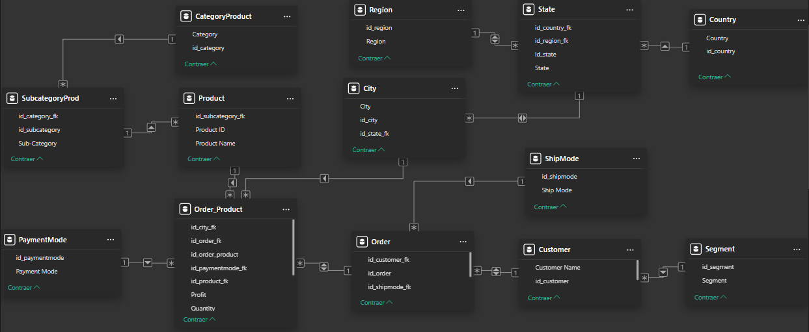

# Superstore 
### Presente:
Se tiene la gestión de la empresa Superstore de venta de muebles, elementos de oficina y tecnología manejada mediante una tabla en excel.
### Propósito del análisis:
Valorar el presente de la empresa respecto a sus ventas, ya sea por lugar o categoría y sus ganancias, además de analizar cómo se comportan los clientes.   

Se realizaron los siguientes pasos para el análisis: 

1. Se analizó la tabla de Excel anexada (“SuperStore Sales DataSet.xlsx”) para ver si habían atributos que no tenían pie, además de buscar errores o tipos de datos erróneos.
2. Se normalizó la tabla usando la 1NF, la 2NF y la 3NF, obteniendo el siguiente resultado:  
   
3. Se creó un dashboard inicial usando los atributos del modelo relacional llamado Sales Report, donde se observa algunos datos de ventas respecto a:  
   a. Región.<br>
   b. Segmento.<br>
   c. Método de pago.<br>
   d. Método de envío.<br>
   e. Categoría.<br>
   f. Subcategoría.<br>
   g. Por ciudad usando un Mapa.<br>
   h. Por año día a día.<br>
   i. Total general.<br>
4. Se generó otro dashboard llamado Sales Repor 2, donde se usa la herramienta de forecasting para analizar 15 días futuros con una estacionalidad de 7 puntos, puesto que los picos más bajos se presentan cada 7 días. También se generan otros visuales que si usan DAX:
   a. Se generó un visual para el acumulado de cada año, se usó la siguiente sentencia DAX:<br>
     ```sql
     Cumulative Sales = 
      CALCULATE (
          SUM ( Order_Product[Sales] ),
          FILTER (
              ALL ( 'Order'[Order Date] ),
              'Order'[Order Date] <= MAX ( 'Order'[Order Date] )
          )
      )
     ```
     Se suman las ventas teniendo en cuenta todas las fechas (por eso all(order)). Luego dentro del gráfico de líneas se ponen los parámetros de los ejes.
      
    b. El otro visual es un medidor de ventas del 2020 respecto al 2019, se usaron dos sentencias DAX básicas para poder conocer las ventas de cada año:<br>
    ```sql
    Total acumulado 2019 = 
      CALCULATE(
      	SUM('Order_Product'[Sales]),
      	'Order'[Order Date]<DATE(2020,01,01)
      )

    Total acumulado 2020 = 
      CALCULATE(
      	SUM('Order_Product'[Sales]),
      	'Order'[Order Date]>=DATE(2020,01,01)
      )
    ```
5. En el tercer dashboard llamado Dashboard Customers se realiza un entendimiento de los patrones de compra de los clientes, donde se tienen que crear en algunas ocasiones tablas calculadas o simplemente una medida, a continuación, se muestra:
   a. Clientes de segmentación corporación que enviaron por primera clase y pagaron online:
   ```sql
   OnlineXCorporateXFirstClass = 
		CALCULATE(
			COUNTA('Order'[id_order]),
			PaymentMode[Payment Mode] = "Online",
			ShipMode[Ship Mode] = "First Class",
			Segment[Segment] = "Corporate"
		)
   ```
   Se filtra de manera básica con un calculate, donde cada filtro funciona como un 'and'.<br>
   b. Promedio de días de entrega.<br>
   ```sql
   DeliveryDays = 
      AVERAGEX (
          'Order',
          DATEDIFF ( 'Order'[Order Date], 'Order'[Ship Date], DAY )
      )
   ```  
   Se toma la fecha de entrega menos la de envío de cada orden, y se promedia.  
   c. Saber cuáles son los clientes que compran en el este o en el oeste, más no en ambos lugares, y que pagaron toda su orden con solo un método de pago agrupados por categorías.
   ```sql
    categoriasEastWest = 
    	VAR clientesXcategoriaXregionXpay = SUMMARIZE(
    		ADDCOLUMNS(
    			Order_Product,
    			"cliente", RELATED(Customer[id_customer]),
    			"categoria", RELATED(CategoryProduct[Category]),
    			"TheRegion", RELATED(Region[Region])
    		),
    		[cliente],
    		[categoria],
    		[TheRegion],
    		Order_Product[id_paymentmode_fk]
    	)
    
    	VAR clienteXregion = SUMMARIZE(
    		clientesXcategoriaXregionXpay,
    		[cliente],
    		[TheRegion]
    	)
    	VAR agruparRegion = FILTER(
    		GROUPBY(
    			clienteXregion,
    			[cliente],
    			"isOne",
    			COUNTX(
    				CURRENTGROUP(),
    				[TheRegion]
    			)
    		),
    		[isOne] = 1
    	)
    
    	VAR joinAgrupacion = FILTER(
    		NATURALINNERJOIN(
    			clientesXcategoriaXregionXpay,
    			agruparRegion
    		),
    		[TheRegion] = "East" || [TheRegion] = "West"
    	)
    
    	VAR clientexpaymode = SUMMARIZE(
    		joinAgrupacion,
    		[cliente],
    		[id_paymentmode_fk]
    	)
    
    	VAR agrupacionPaymode = FILTER(
    		GROUPBY(
    			clientexpaymode,
    			[cliente],
    			"isJustOne",
    			COUNTX(
    				CURRENTGROUP(),
    				[id_paymentmode_fk]
    			)
    		),
    		[isJustOne] = 1
    	)
    
    	VAR agrupacionClienteXCat = SUMMARIZE(
    		NATURALINNERJOIN(
    			joinAgrupacion,
    			agrupacionPaymode
    		),
    		[categoria],
    		[cliente]
    	)
    
    	RETURN
    		GROUPBY(
    			agrupacionClienteXCat,
    			[categoria],
    			"Total",
    			COUNTX(
    				CURRENTGROUP(),
    				[cliente]
    			)
    		)	
   ```  
   En este caso, se creó una tabla calculada, donde lo que se hace es:
   - asd
   - asda
